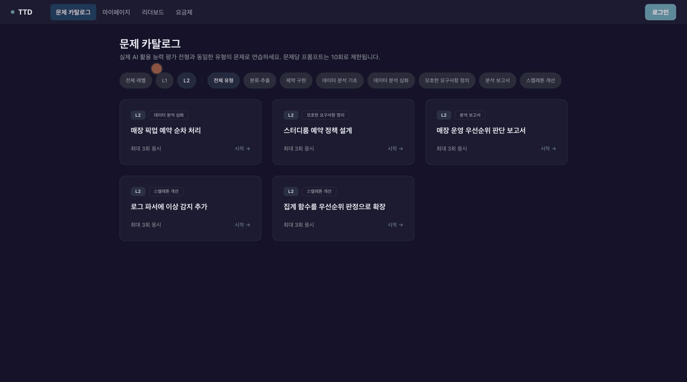

# TTD 프론트엔드 레포지토리

[](https://github.com/polytech-zero-day/TTD-Front/actions/workflows/ci.yml)
[](https://react.dev)
[](https://vitejs.dev)
[](https://www.typescriptlang.org)


<br>

<div align="center"><h1>⌨️ TTD (Text To Develop) — AI 활용 역량 진단 플랫폼</h1></div>

<div align="center"><b>“프롬프트로 증명하는 순간”</b></div>

<br>

**"문제, 프롬프트, 채점, 리더보드"** — 실제 기업 전형 형식의 문제를 AI와 함께 풀고, 결과물의 **품질**과 사용 **효율**(토큰·시도 횟수)을 함께 채점받아 다른 응시자와 비교하는 웹 서비스입니다.

<br>

## 목차

- [목차](#목차)
- [프로젝트 소개](#프로젝트-소개)
  - [💡 프로젝트를 왜 시작하게 되었나요?](#-프로젝트를-왜-시작하게-되었나요)
  - [🔑 프로젝트의 핵심은 무엇인가요?](#-프로젝트의-핵심은-무엇인가요)
  - [🎁 프로젝트가 가져올 수 있는 기대 효과는 무엇인가요?](#-프로젝트가-가져올-수-있는-기대-효과는-무엇인가요)
- [팀 소개](#팀-소개)
- [개발 기간](#개발-기간)
- [기술 스택](#기술-스택)
- [시스템 아키텍처](#시스템-아키텍처)
- [핵심 기능 소개](#핵심-기능-소개)
- [프로젝트 구조](#프로젝트-구조)
- [로컬 실행](#로컬-실행)
- [테스트 \& CI](#테스트--ci)

---

<br>

## 프로젝트 소개

TTD는 "코드를 직접 짜는 능력"이 아니라

**AI에게 원하는 결과물을 정확히 지시하고, 그 결과를 검증·개선하는 능력**을 정량 지표로 진단하는

AI 활용 역량 진단 플랫폼입니다.

<br>

### 💡 프로젝트를 왜 시작하게 되었나요?

요즘 채용 공고에는 "AI 활용 능력 우대"라는 문구가 넘쳐나지만, 정작 그 능력을 **증명할 수단**은 없습니다.

이력서에 "ChatGPT 잘 씁니다"라고 쓸 수는 있어도 검증할 방법이 없고, 기존 코딩테스트는 정답 결과만 보기 때문에 **AI에게 어떻게 지시하고 검증했는지의 과정**은 평가하지 못합니다.

실무 요구도는 치솟는데 측정 수단은 없는 이 간극을 메우기 위해 **TTD** 프로젝트를 기획하게 되었습니다.

<br>

### 🔑 프로젝트의 핵심은 무엇인가요?

**"정답 생성이 아니라, AI와 어떻게 일했는지를 채점한다"** 입니다.

- **종합 점수 = 품질 60% + 효율 40%** — 결과물의 좋고 나쁨(루브릭 3항목)과, 얼마나 적은 토큰·시도로 도달했는가를 동시에 평가합니다.
- 루브릭 3항목: **요구사항 충족(40) · 근거 제시의 구체성(30) · AI 활용 과정의 타당성(30)** — 세 번째 항목은 결과물이 아니라 응시자가 AI와 주고받은 **대화 이력 자체**를 평가합니다.
- 점수만 주지 않고 **항목별 근거를 전부 공개**하여, 다음 프롬프트를 개선할 수 있게 합니다.

<br>

### 🎁 프로젝트가 가져올 수 있는 기대 효과는 무엇인가요?

- **응시자 측면**
  - 막연했던 "AI 활용 능력"을 품질·효율 정량 점수와 리더보드 위치로 확인할 수 있습니다.
  - 루브릭 근거 공개로 어떤 지시·검증이 좋은 프롬프트인지 학습할 수 있습니다.
- **채용사 측면**
  - 서류로 검증 불가능했던 AI 협업 역량을 전형 데이터로 확보할 수 있습니다.
  - 문제 뱅크 확장·B2B 연동 시 자체 전형 도구로 활용할 수 있습니다.

<br>

## 팀 소개

<div align="center">

|                                                **👑 한성민**                                                 |                                                  **윤여훈**                                                  |                                                    **고윤**                                                     |                                                   **차윤희**                                                    |
| :----------------------------------------------------------------------------------------------------------: | :----------------------------------------------------------------------------------------------------------: | :-------------------------------------------------------------------------------------------------------------: | :-------------------------------------------------------------------------------------------------------------: |
| [ <br/> @kkx7787](https://github.com/kkx7787) | [ <br/> @Hoon-KR](https://github.com/Hoon-KR) | [ <br/> @K-yoon03](https://github.com/K-yoon03) | [ <br/> @chayh414](https://github.com/chayh414) |
|                                               **팀장 · C파트**                                               |                                                  **A파트**                                                   |                                                    **B파트**                                                    |                                                    **D파트**                                                    |
|                             응시·AI 실행·채점 파이프라인, 결제·구독, CI/CD·보안                              |                                    문제 도메인, 캘리브레이션 기준 데이터                                     |                                         백오피스, JWT 인증, 관리자 화면                                         |                                      리포트·리더보드·마이페이지, 화면 설계                                      |

</div>

<br>

## 개발 기간

- **프로젝트 기간** : 2026년 7월 3일 ~ 2026년 7월 14일 (12일 스프린트)
- **개발 집중 기간** : 2026년 7월 6일 ~ 7월 14일
- **배포** : 2026년 7월 13일 (AWS S3 · EC2 · RDS)
- **최종 발표 및 평가** : 2026년 7월 14일 — 제로 데이

---

<br>

## 기술 스택

| **분류**      | **스택**                                                                                                                                                                                                                        |
| ------------- | ------------------------------------------------------------------------------------------------------------------------------------------------------------------------------------------------------------------------------- |
| **Language**  |                                                                                                                       |
| **Framework** |                       |
| **Build**     |                                                                                                                                         |
| **Style**     |  — 다크 테마 디자인 토큰(`tokens.css`) 단일 소스                                                                   |
| **결제**      |  — 빌링키 월 구독                                                                                                                                  |
| **Test**      |                 |
| **Quality**   |                                   |
| **Deploy**    |   |

<br>

## 시스템 아키텍처


- **S3 정적 SPA + EC2 단일 인스턴스(Spring Boot · Docker Compose) + RDS PostgreSQL** 3계층 구조
- GitHub Actions **CI를 통과한 커밋만** GHCR 이미지 빌드 → EC2·S3 배포

<br>

## 핵심 기능 소개

### 🗂 문제 카탈로그 — 레벨·유형 필터로 골라 응시

- 실제 기업 전형 형식의 문제 10종 (분류·추출 / 제약 구현 / 데이터 분석 / 모호한 요구사항 정의 / 분석 보고서 / 스켈레톤 개선)
- 레벨(L1/L2)·유형 태그 필터링, 문제별 요구사항·제약 조건·채점 방식 확인



<br>

### ⌨️ 3분할 응시 화면 — 문제 · AI 채팅 · 결과물 제출

- 좌측 문제문 / 중앙 AI 채팅 / 우측 결과물 제출의 리사이즈 가능한 워크스페이스
- 프롬프트마다 **토큰·시도 횟수가 자동 기록**되어 효율 점수에 반영 — 적정선을 넘기면 감점되므로 "한 번에 정확히 지시하는" 프롬프트를 고민하게 됩니다
- 응시 중 이탈해도 세션이 유지되며, 재진입 시 대화·남은 시간이 복원됩니다


> 채점 결과 화면에서는 루브릭 3항목별 점수·근거, 회차별 타임라인, 품질-효율 산점도(상위 10% 구간·내 위치 강조)를 제공합니다.

<br>

### 📊 마이페이지 — 내 성장 데이터 한눈에

- 평균 품질·효율 점수, 총 시도·토큰 사용량 등 개인 통계
- 전체 응시자 분포 위 내 위치를 보여주는 품질-효율 산점도, 제출 이력 타임라인
- 닉네임 인라인 편집, 구독 상태 확인


<br>

### 🏆 리더보드 — 품질·효율 분리 표기로 강점 진단

- 종합(품질 60 + 효율 40) 기준 **전체 랭킹 / 문제별 랭킹**
- 상위 10명 평균 시도·토큰 공개 — "상위권은 1.5회 만에 끝낸다" 같은 구체적 벤치마크 제공


<br>

### 💳 요금제 & 구독 결제 — FREE로 체험하고 PAID로 무제한

- FREE: 문제별 응시 3회 · 응시당 프롬프트 10회 / PAID(₩9,900/월): 상위 모델(gpt-5.4) 응시 + 응시·프롬프트 무제한
- **채점 방법론은 무료·유료 관계없이 동일** — 유료는 응시 편의만 제공합니다


<br>

### 🛠 관리자 백오피스 — 운영과 채점 품질까지 관리

- **대시보드**: 사용자·문제 현황과 상태 분포, 최근 활동 피드
- **문제 관리**: 문제 CRUD와 상태 전환(초안 → 검토 대기 → 게시)
- **AI 모델 설정**: 응시 대화·루브릭 채점 용도별 모델을 서버 재시작 없이 즉시 교체
- **캘리브레이션**: 기준 샘플 30건을 실제 채점해 사람 기준과의 등급 일치율·점수 오차를 측정 (티어 밴드·허용 오차 파라미터 조정 가능)
- **사용자 관리**: 회원 목록 조회·권한 변경(USER↔ADMIN)·계정 생성/삭제


<br>

## 프로젝트 구조

```
src
├── components
│   ├── ui             # 공통 UI 컴포넌트
│   └── feature        # 도메인별 (admin / attempt / auth / pricing / result)
├── pages              # 라우트 페이지 (admin 하위 포함 17종)
├── hooks              # 커스텀 훅
├── lib
│   ├── api            # 백엔드 API 클라이언트 (401 자동 재발급)
│   ├── auth           # 세션 · ProtectedRoute
│   ├── payment        # PortOne 연동 (F117 데모 폴백)
│   └── subscription   # 구독 상태
├── data               # 정적 데이터(요금제 등)
├── types              # 공유 타입
└── styles             # 디자인 토큰(tokens.css)
```

<br>

## 로컬 실행

```bash
npm install
npm run dev        # http://localhost:5173 — TTD-Backend(:8080) 필요
```

> PortOne 등 공개 키는 `.env.local`에 `VITE_` 접두사로 설정합니다. 시크릿은 프론트에 두지 않습니다.

<br>

## 테스트 & CI

- **단위/훅**: Vitest + Testing Library — 36케이스
- **E2E**: Playwright(chromium) — 공개 플로우 3시나리오, dev 서버 자동 기동
- **CI**: develop 대상 push·PR마다 `lint → format:check → build(tsc -b) → vitest → E2E` 자동 검증, 통과 시에만 Rebase & Merge
- **CD**: CI 통과 커밋만 `aws s3 sync`로 정적 배포

<br>

<div align="center">

**Backend Repository** 👉 [polytech-zero-day/TTD-Backend](https://github.com/polytech-zero-day/TTD-Backend)

</div>
